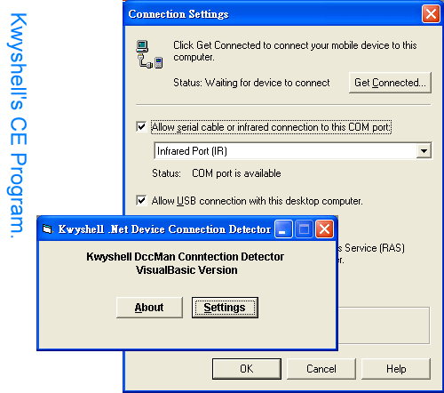



## Win CE Device Connection Detect

### Description

The code here uses to detect the device connection whenever user connects or disconnets the CE device with your pc.
 
### More Info
 
You need to install microsoft ativesync 3.0 first. To monitor the device connection, you need to implement IDccManSink and IDccMan interface. But the system only provide a c style header file, vb users need to implement by themselves. Here I create a vb friendly type library for vb users.

             |
---                |---
**Submitted On**   |2002-04-03 21:59:26
**By**             |[Kwyshell](https://github.com/Planet-Source-Code/PSCIndex/blob/master/ByAuthor/kwyshell.md)
**Level**          |Intermediate
**User Rating**    |5.0 (25 globes from 5 users)
**Compatibility**  |VB 5\.0, VB 6\.0
**Category**       |[Windows CE](https://github.com/Planet-Source-Code/PSCIndex/blob/master/ByCategory/windows-ce__1-41.md)
**World**          |[Visual Basic](https://github.com/Planet-Source-Code/PSCIndex/blob/master/ByWorld/visual-basic.md)
**Archive File**   |[Win\_CE\_Dev68255432002\.zip](https://github.com/Planet-Source-Code/kwyshell-win-ce-device-connection-detect__1-33384/archive/master.zip)

